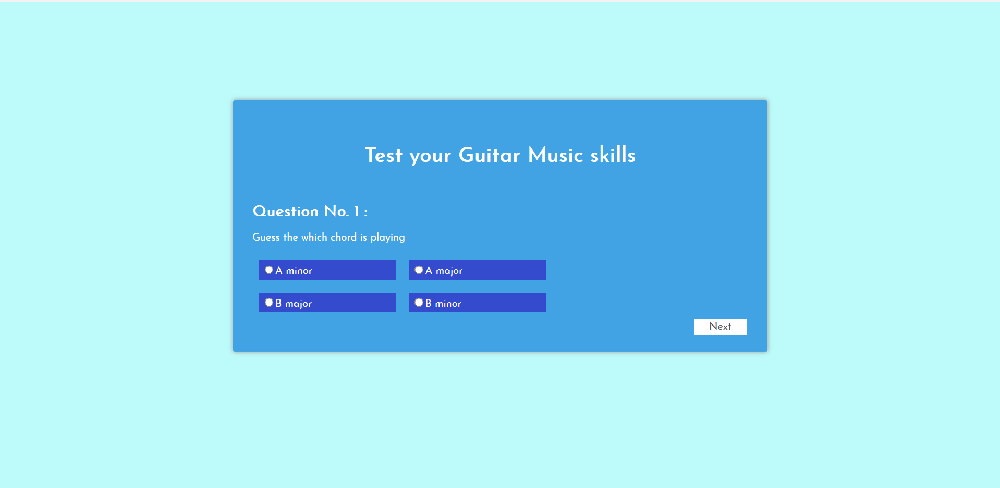
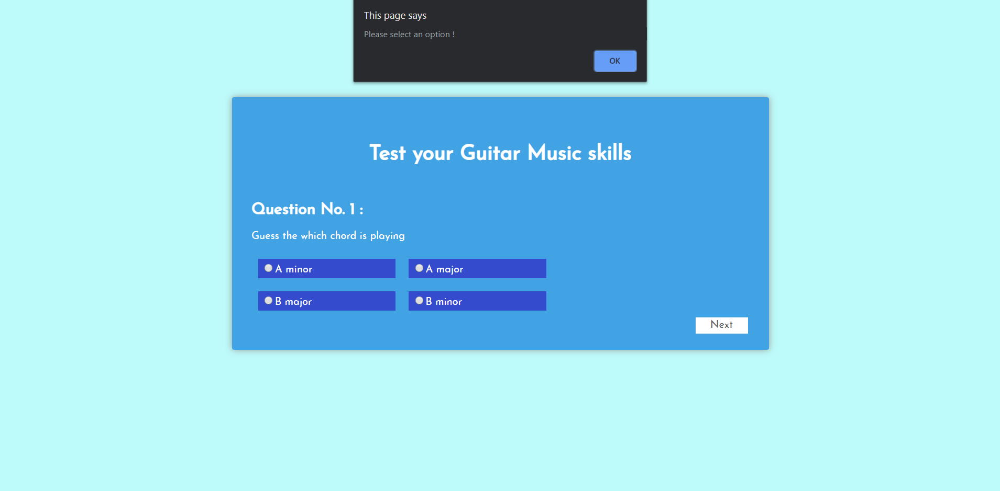
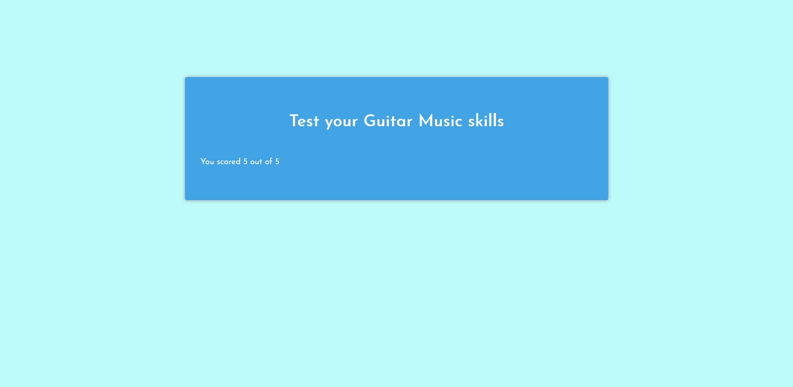

# Guess the chord

A simple quiz in which Guitar chords will be played and the user has to guess the chord

## Features

A quiz has 5 questions

- When the new question appears at that time,The audio plays and the user has to guess the chord

- Then user has to guess the option and select it
  
- If user does not select any option,then alert is popped and requets user to select the option
  
- When all 5 question are answered then result is shown
  

## Purpose -

This game will help the user to boost memory,differentiate between differents chord,help them in their music and test their music skills.
